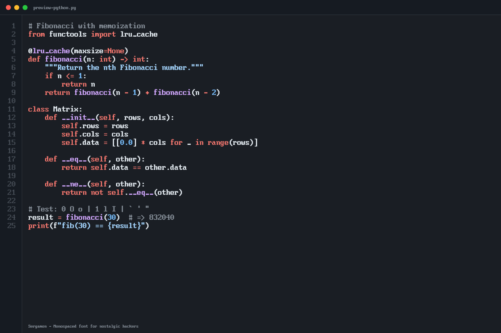

<div align="center">

<br />


<br />

**Pixel-perfect monospaced font for code. No ligatures. No surprises.**

[](https://opensource.org/licenses/OFL-1.1)
[](https://github.com/sgmonda/sergamon/actions/workflows/build.yml)
[](https://sgmonda.com/sergamon)
[](https://nodejs.org)

[Website](https://sgmonda.com/sergamon) &bull; [Download](https://github.com/sgmonda/sergamon/releases/latest) &bull; [Contributing](CONTRIBUTING.md)

---

<picture>
  <source media="(prefers-color-scheme: dark)" srcset="assets/preview-python.png" />
  <source media="(prefers-color-scheme: light)" srcset="assets/preview-python-light.png" />
  
</picture>

</div>

<br />

## Why Sergamon?

Most programming fonts chase the same goals: ligatures, multiple weights, smooth curves. Sergamon goes the opposite direction.

Every glyph is hand-crafted on an **8x16 pixel grid** — the same constraints as a classic hardware terminal. The result is a font that is sharp, predictable, and honest:

- **`==` is two equal signs.** `->` is a hyphen and a greater-than. No ligatures, no magic substitutions — your source code looks exactly as you typed it.
- **One weight.** No bold, no light, no italic. Like a real terminal, every character has the same stroke.
- **Confusables are distinct.** `0/O/o`, `1/l/I`, `` ` ``/`'`/`"` — each pair is carefully designed to be unambiguous at a glance.
- **Massive coverage.** 3,700+ glyphs spanning Latin, Cyrillic, Greek, Hebrew, Arabic, Thai, Devanagari, Georgian, Armenian, box-drawing, braille, math operators, and more.

## Quick Install

Download the latest **[Sergamon.ttf](https://github.com/sgmonda/sergamon/releases/latest)** (desktop) or **[Sergamon.woff2](https://github.com/sgmonda/sergamon/releases/latest)** (web) from the Releases page.

<details>
<summary><strong>macOS</strong></summary>

1. Double-click `Sergamon.ttf` and click **Install Font** in Font Book.

> **Updating?** macOS caches font metadata aggressively. Remove the old font first, then:
> ```bash
> sudo atsutil databases -remove
> sudo killall fontd
> ```

</details>

<details>
<summary><strong>Windows</strong></summary>

Right-click `Sergamon.ttf` and select **Install** (or **Install for all users**).

</details>

<details>
<summary><strong>Linux</strong></summary>

```bash
cp Sergamon.ttf ~/.local/share/fonts/
fc-cache -fv
```

</details>

## Editor & Terminal Setup

<details open>
<summary><strong>VS Code</strong></summary>

```json
{
  "editor.fontFamily": "'Sergamon', monospace",
  "editor.fontSize": 16,
  "editor.letterSpacing": 0
}
```

</details>

<details>
<summary><strong>JetBrains IDEs</strong> (IntelliJ, WebStorm, PyCharm, etc.)</summary>

**Settings > Editor > Font** — set **Font** to `Sergamon`, **Size** to `16`.

</details>

<details>
<summary><strong>Sublime Text</strong></summary>

```json
{
  "font_face": "Sergamon",
  "font_size": 16
}
```

</details>

<details>
<summary><strong>Vim / Neovim (GUI)</strong></summary>

```vim
set guifont=Sergamon:h16
```

</details>

<details>
<summary><strong>iTerm2</strong></summary>

**Preferences > Profiles > Text** — set **Font** to `Sergamon`, **Size** to `16`.
Disable **Use bold fonts** and **Draw bold text in bright colors** for best results.

</details>

<details>
<summary><strong>Windows Terminal</strong></summary>

```json
{
  "profiles": {
    "defaults": {
      "font": {
        "face": "Sergamon",
        "size": 16
      }
    }
  }
}
```

</details>

<details>
<summary><strong>Alacritty</strong></summary>

```toml
[font]
size = 16.0

[font.normal]
family = "Sergamon"
```

</details>

## Web Usage

```css
@font-face {
  font-family: 'Sergamon';
  src: url('/fonts/Sergamon.woff2') format('woff2'),
       url('/fonts/Sergamon.ttf') format('truetype');
  font-display: swap;
}

code, pre {
  font-family: 'Sergamon', monospace;
}
```

Or load directly from the project site:

```css
@font-face {
  font-family: 'Sergamon';
  src: url('https://sgmonda.com/sergamon/fonts/Sergamon.woff2') format('woff2');
  font-display: swap;
}
```

## How It Works

Sergamon treats glyph definitions as source code. Each character lives in a plain-text `.glyph` file — an 8x16 pixel grid that a TypeScript pipeline compiles into vector font files.

```
# zero (U+0030)

........   . = empty pixel
........   X = filled pixel
........   8 columns wide
.XXXXX..  16 rows tall
XX...XX.
XX...XX.
XX..XXX.
XX.XXXX.
XXXX.XX.
XXX..XX.
XX...XX.
XX...XX.
.XXXXX..
........
........
........
```

```
.glyph files ──> parse ──> validate ──> optimize ──> vectorize ──> TTF ──> WOFF2
```

The optimizer merges adjacent filled pixels into larger rectangles before converting to vector paths, keeping the output compact and efficient.

## Contributing

Contributions are welcome — whether refining an existing glyph, adding a new character, or improving the build pipeline. See **[CONTRIBUTING.md](CONTRIBUTING.md)** for everything you need: file format, style guidelines, testing workflow, and PR process.

<br />

## License

**Font files and glyph sources** — [SIL Open Font License 1.1](LICENSE)
**Build scripts and site code** — MIT License
